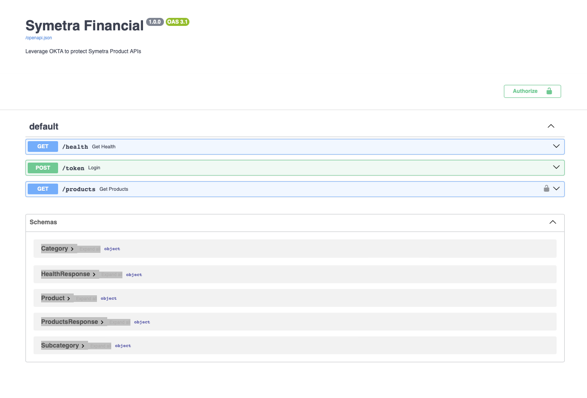
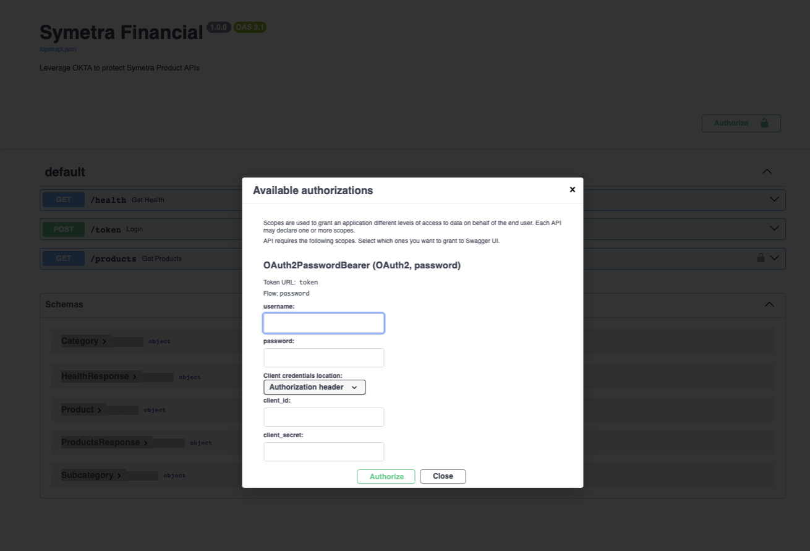
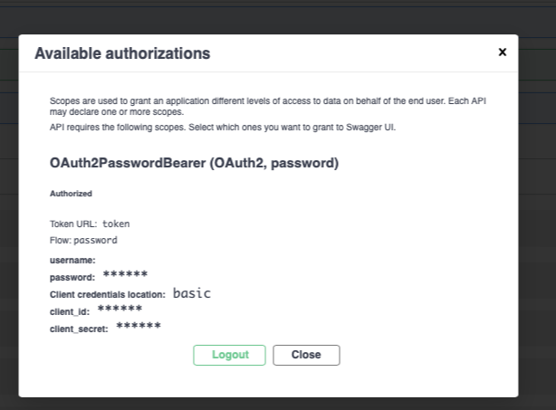
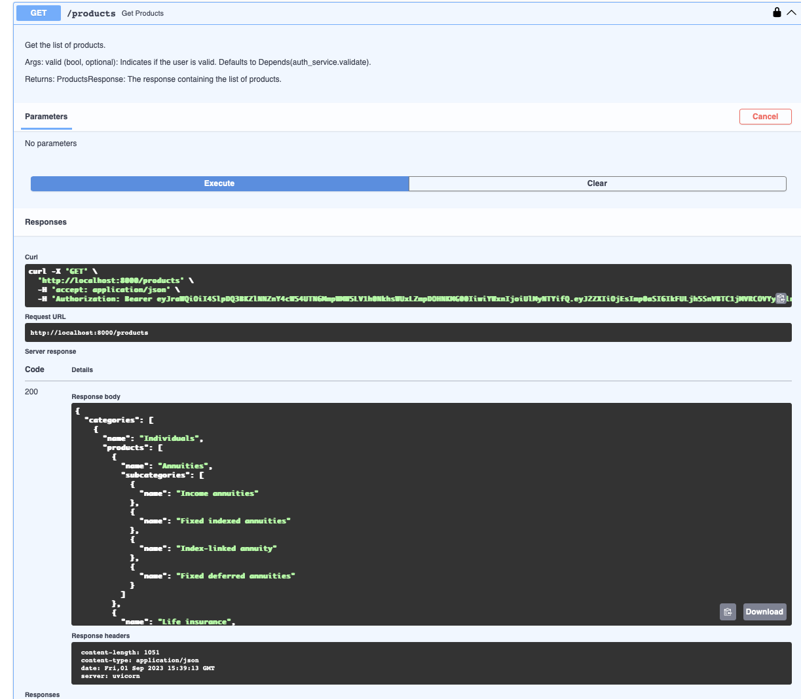

# SymetraService
[](https://www.python.org/downloads/release/python-385/)
[

[]


## Relevant Guides
- [Python](https://docs.python.org/3.7/)
- [FastAPI](https://fastapi.tiangolo.com/)
- [OKTA](https://developer.okta.com/)
- [HTTPX](https://www.python-httpx.org/)


Certainly! Here's an updated README.md with the additional instructions:

---

## Overview

### Background

The **Symetra Microservice** is a demonstration of secure API development using FastAPI in conjunction with the OKTA authentication service. This microservice showcases the implementation of secure and protected API endpoints using FastAPI's capabilities and adhering to OpenAPI specifications (version 3.0).

### Features

- **Authentication**: Utilizes OKTA's authentication service to ensure secure access to API endpoints.
- **FastAPI**: Developed using the FastAPI framework, known for its speed and automatic generation of interactive API documentation.
- **OpenAPI Specs**: Follows the OpenAPI specification version 3.0 to define API contracts and enable seamless interaction with the service.
- **Demo Endpoints**: Provides a set of sample API endpoints that serve as a practical demonstration of secure API development.
- **To-Do List**: Includes a list of pending tasks, such as Docker containerization and unit test implementation, to further enhance the microservice.

### Prerequisites

Before running the Symetra Microservice, ensure that you have the following prerequisites in place:

- [OKTA](https://www.okta.com/) Account: Sign up for an OKTA account and configure it for API authentication.
- Python Environment: Set up a Python environment to run the FastAPI application.
- Docker (Optional): If you plan to containerize the application, make sure Docker is installed.

### Getting Started

Follow these steps to get started with the Symetra Microservice:

1. **Authentication Configuration**: Configure the OKTA authentication service and obtain the necessary credentials.

2. **Environment Setup**: Create a virtual environment and activate it by running the following commands:

   ```bash
   ./install.sh
   source venv/bin/activate
   ```

3. **Application Configuration**: Configure the application by specifying the OKTA issuer URL and other relevant settings.

4. **Local Service**: Start the service locally by running:

   ```bash
   ./scripts/run_local.sh
   ```

### Usage
1. **Interactive API**: Open your browser and navigate to [http://localhost:8000/docs](http://localhost:8000/docs) to access the interactive API documentation (Swagger).

   
2. **OAuth2 Authorization**: Click the "Authorize" button to set up OAuth2PasswordBearer/Authorization. Provide the "client_id" and "client_secret" related to your OKTA account.



3. **Access Products Endpoint**: After authorization, you can access the "/products" endpoint to retrieve the list of Symetra products. This endpoint utilizes the generated token from the previous step to secure access.


### TODO

- [ ] Implement Docker containerization.
- [ ] Develop and run unit tests.

---
